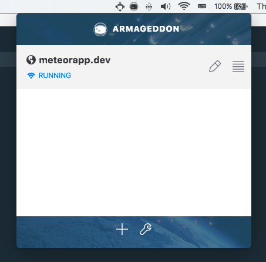

# Armageddon - a meteor.js app manager

Armageddon is a desktop app designed to make running local meteor apps easier.
Apps can be loaded into the menu bar interface and then accessed using a local domain name.

### Todos

* xip.io
* SSL
* Meteor Config (Settings, etc.)
* Log Files
